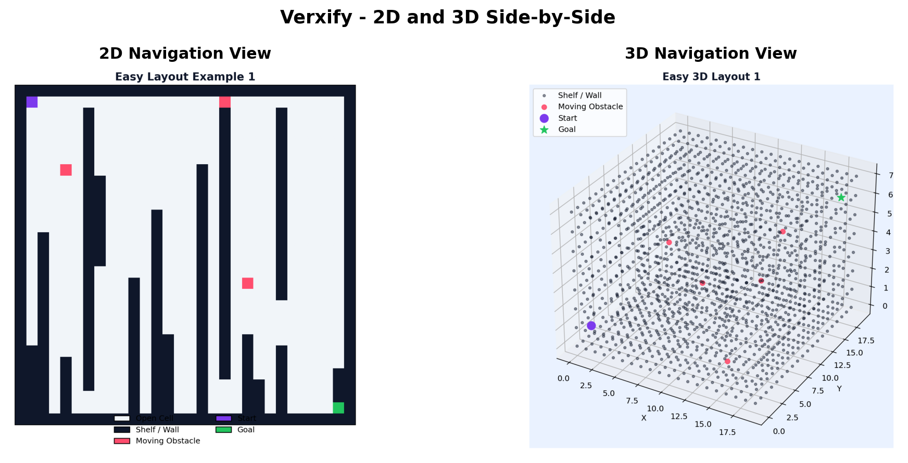
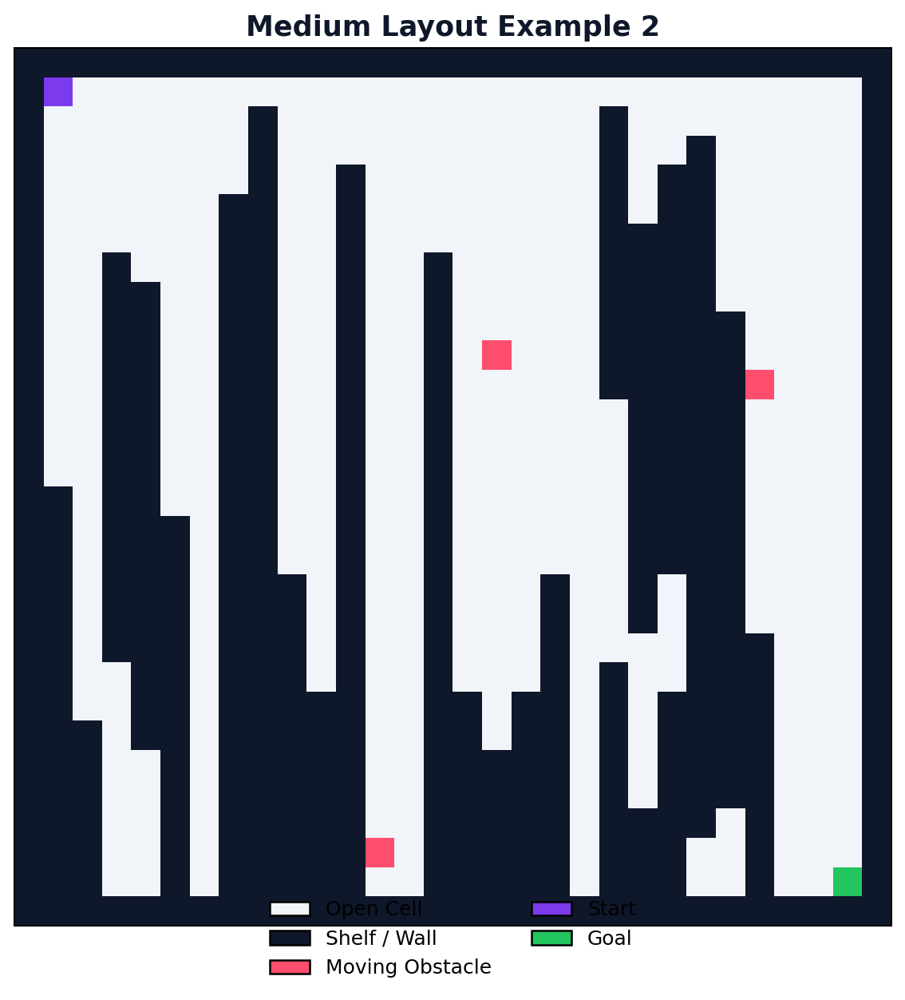
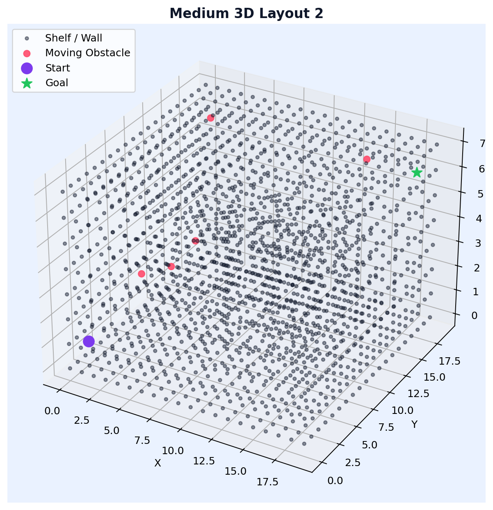

# Verxify

## Overview

Verxify is a warehouse navigation intelligence simulator built for both 2D grid maps and 3D voxel environments. The goal is to train and evaluate robot navigation behavior in realistic, obstacle-heavy layouts where paths can change at runtime.

The project combines classical planning methods and reinforcement learning so teams can compare deterministic baselines against adaptive policies. Verxify is designed to be understandable for student projects while still being strong enough to communicate real product potential.

In warehouse operations, navigation reliability is not a minor feature. It directly impacts throughput, worker safety, and operational cost. Verxify focuses on that core problem by modeling dynamic obstacles, noisy sensing, and measurable policy quality instead of only reporting goal success.



## Why The Product Matters

Many automation systems perform well in static tests but degrade when aisles change, temporary pallets appear, or traffic patterns shift. These failures create delays and force manual intervention. Verxify provides a practical simulation-first workflow to test navigation logic under changing conditions before deployment.

Because Verxify supports both 2D and 3D environments, it can be used for fast iteration in 2D and richer spatial testing in 3D. This dual setup helps teams validate ideas quickly while still moving toward more realistic scenarios.

## Core Capabilities

- 2D environment generation with difficulty presets and moving obstacles
- 3D voxel environment generation with connectivity validation
- Sensor simulation for 2D and 3D observation vectors
- Pathfinding baselines in both dimensions (BFS, Dijkstra, A*)
- Q-learning and DQN training pipelines
- Logging, diagnostics, scoring, failure analysis, and benchmarking
- Visual outputs for environment layouts and model behavior





## What Was Used To Build Verxify

### Language

- Python

### Libraries

- NumPy for array operations and feature processing
- PyTorch for deep Q-network implementation
- Matplotlib for visualizations, plots, and 3D figures

## Repository Structure

```text
verxify/
├── main.py
├── environment.py
├── environment3d.py
├── sensors.py
├── sensors3d.py
├── pathfinder.py
├── pathfinder3d.py
├── q_agent.py
├── dqn_agent.py
├── benchmark.py
├── diagnostics.py
├── scorer.py
├── analyzer.py
├── failure_logger.py
├── comparator.py
├── logger.py
├── visualizer.py
├── generate_examples.py
├── generate_examples_3d.py
├── config.json
├── examples/
└── README.md
```

## Pipeline

1. Generate a valid 2D or 3D warehouse environment.
2. Simulate observations from the sensor module.
3. Run pathfinding baselines and/or learning agents.
4. Log reward, stability, health, and failure metrics.
5. Analyze output with plots, leaderboards, and diagnostics reports.

## CLI Modes

### 2D

- `python main.py --mode train-q --difficulty medium --episodes 500 --seed 42`
- `python main.py --mode train-dqn --difficulty medium --episodes 500 --seed 42`
- `python main.py --mode test --difficulty medium --seed 42`
- `python main.py --mode astar --difficulty medium --seed 42`
- `python main.py --mode benchmark --difficulty medium --seed 42`

### 3D

- `python main.py --mode test-3d --seed 42`
- `python main.py --mode astar-3d --seed 42`
- `python generate_examples_3d.py`

## Configuration

`config.json` includes settings for both environment types, training hyperparameters, diagnostics thresholds, navigation scoring weights, and output paths.

For 3D, `environment_3d` controls voxel size, difficulty, and moving obstacle count.

## Lessons From This Project

Supporting 2D and 3D in one codebase increases complexity, but it also creates a stronger product architecture. Fast 2D iteration and richer 3D validation complement each other.

Reliable metrics beyond reward are essential. Diagnostics, difficulty scoring, and failure classification provide the insight needed to improve policy quality in realistic warehouse conditions.
