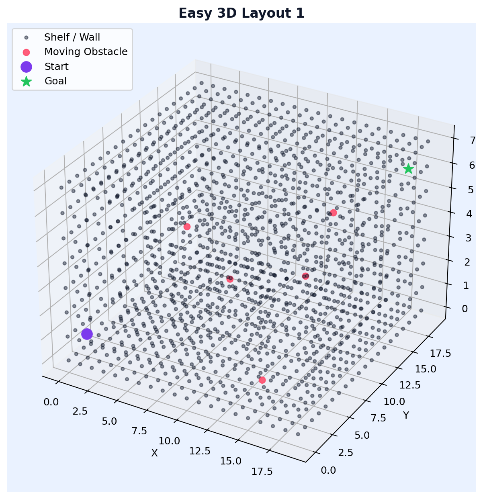
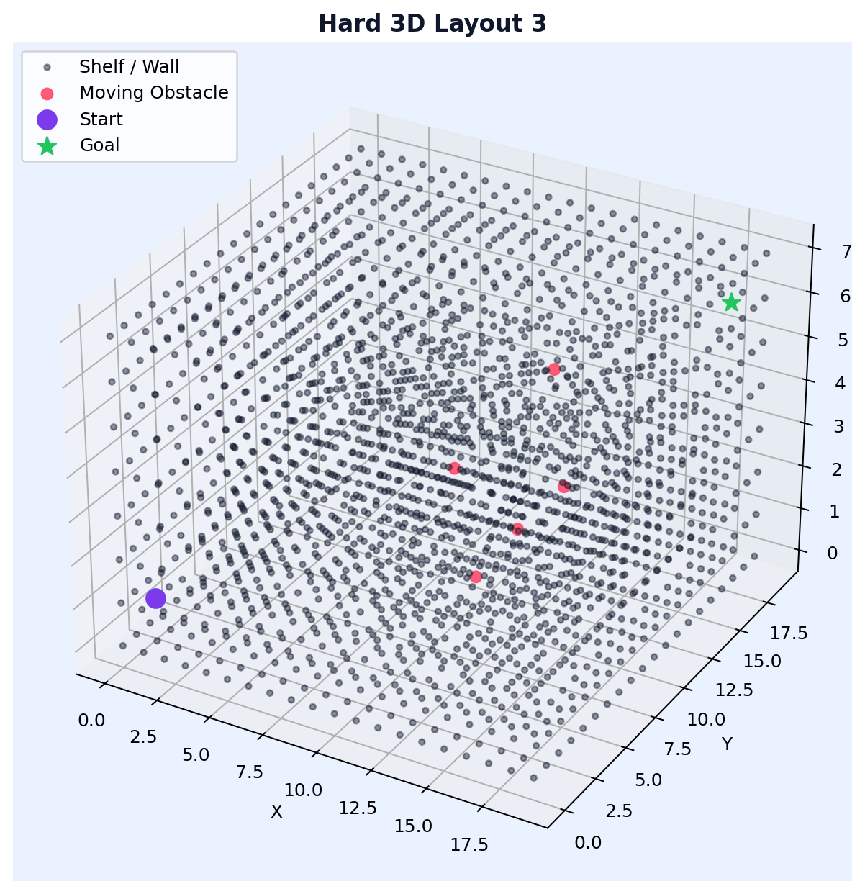

# Verxify 3D

## Overview

Verxify 3D is a Python warehouse navigation simulator built around voxel-based 3D environments. It extends the previous 2D approach into full 3D path planning with dynamic obstacles, realistic sensing features, and baseline algorithm comparisons.

The project includes both legacy 2D modules and new 3D modules so experiments can be compared across dimensions.



## What Changed In The 3D Upgrade

- Added `environment3d.py` for 3D voxel warehouse generation
- Added `sensors3d.py` for 3D ray features and goal orientation
- Added `pathfinder3d.py` with BFS, Dijkstra, and A* in 3D
- Added `generate_examples_3d.py` for documentation visuals
- Added CLI modes: `test-3d` and `astar-3d`
- Added `environment_3d` configuration section in `config.json`

## Languages And Libraries Used

- Python
- NumPy
- PyTorch
- Matplotlib

## Repository Structure

```text
verxify/
├── main.py
├── environment.py
├── environment3d.py
├── sensors.py
├── sensors3d.py
├── pathfinder.py
├── pathfinder3d.py
├── q_agent.py
├── dqn_agent.py
├── benchmark.py
├── diagnostics.py
├── scorer.py
├── analyzer.py
├── failure_logger.py
├── comparator.py
├── logger.py
├── visualizer.py
├── generate_examples.py
├── generate_examples_3d.py
├── config.json
└── README.md
```


## 3D Navigation Pipeline

1. Generate a valid 3D warehouse with BFS connectivity checks.
2. Simulate obstacles and extract 3D sensor observations.
3. Run baseline 3D pathfinders for reproducible comparisons.
4. Visualize voxel layouts and compare complexity by difficulty.

## New 3D CLI Modes

- `python main.py --mode test-3d --seed 42`
- `python main.py --mode astar-3d --seed 42`
- `python generate_examples_3d.py`



## Configuration

`config.json` now includes an `environment_3d` block:

- `size`: voxel dimensions `[x, y, z]`
- `difficulty`: easy, medium, or hard
- `moving_obstacles`: number of dynamic 3D obstacles

## Lessons From This Project

Moving from 2D to 3D significantly changes complexity. Pathfinding cost, obstacle interactions, and visualization clarity all require stronger design choices.

Clear modular boundaries helped this upgrade. The 3D extension was added with new files and minimal disruption to existing 2D workflows.
