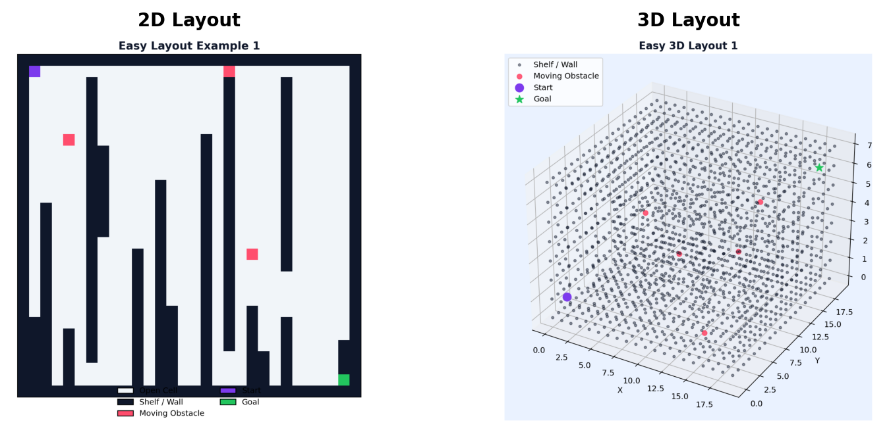

# Verxify

## Overview

Verxify is a warehouse navigation intelligence simulator built for both 2D grid navigation and 3D voxel navigation. It combines classical planning and reinforcement learning so teams can test route quality, reliability, and failure behavior under realistic warehouse constraints.

The platform is designed to be practical, understandable, and deployment-minded. It supports dynamic obstacles, measurable diagnostics, and direct policy evaluation across both 2D and 3D layouts.



## Why The Product Matters

Warehouse automation fails most often at navigation, not motion. When paths break because of changing floor conditions, teams lose throughput, increase labor intervention, and create safety risk in high-traffic aisles. Even short navigation disruptions can ripple into delayed orders, overworked staff, and unstable daily performance.

Verxify addresses that problem directly by giving operators a simulation-first navigation layer that can be stress-tested before deployment. Instead of discovering failures in live operations, teams can validate behavior in controlled scenarios, compare methods, and push better policies with stronger confidence. This reduces downtime risk and improves system trust, which is critical for real warehouse adoption.

## Core Capabilities

- 2D environment generation with moving obstacles and difficulty control
- 3D voxel environment generation with connectivity validation
- 2D and 3D sensor simulation modules
- Baseline pathfinding in both dimensions (BFS, Dijkstra, A*)
- Q-learning and DQN training support
- Logging, diagnostics, scoring, failure analysis, and benchmark tools


## What Was Used To Build Verxify

### Language

- Python

### Libraries

- NumPy for numerical array operations
- PyTorch for deep Q-network training
- Matplotlib for 2D and 3D visualization outputs

## Repository Structure

```text
verxify/
├── main.py
├── environment.py
├── environment3d.py
├── sensors.py
├── sensors3d.py
├── pathfinder.py
├── pathfinder3d.py
├── q_agent.py
├── dqn_agent.py
├── benchmark.py
├── diagnostics.py
├── scorer.py
├── analyzer.py
├── failure_logger.py
├── comparator.py
├── logger.py
├── visualizer.py
├── generate_examples.py
├── generate_examples_3d.py
├── config.json
├── examples/
└── README.md
```

## Pipeline

1. Generate a valid 2D or 3D warehouse layout.
2. Simulate observations from the relevant sensor module.
3. Run pathfinding and/or learning agents.
4. Log reward, stability, health, and failure metrics.
5. Analyze outputs with plots, leaderboards, and diagnostics reports.

## CLI Modes

CLI modes are command-line operation options selected with `--mode`. Each mode runs a different part of the system.

### 2D

- `python main.py --mode train-q --difficulty medium --episodes 500 --seed 42`
- `python main.py --mode train-dqn --difficulty medium --episodes 500 --seed 42`
- `python main.py --mode test --difficulty medium --seed 42`
- `python main.py --mode astar --difficulty medium --seed 42`
- `python main.py --mode benchmark --difficulty medium --seed 42`

### 3D

- `python main.py --mode test-3d --seed 42`
- `python main.py --mode astar-3d --seed 42`
- `python generate_examples_3d.py`

## Configuration

The `config.json` file includes settings for both environment types, training hyperparameters, diagnostics thresholds, navigation scoring weights, and output paths.

For 3D, `environment_3d` controls voxel size, difficulty, and moving obstacle count.

## Lessons From This Project

Supporting both 2D and 3D in one codebase increases complexity, but it also creates a stronger architecture for fast iteration and realistic validation.

Reliable metrics beyond reward are essential. Diagnostics, difficulty scoring, and failure classification provide the visibility needed to improve policy quality in real warehouse conditions.
